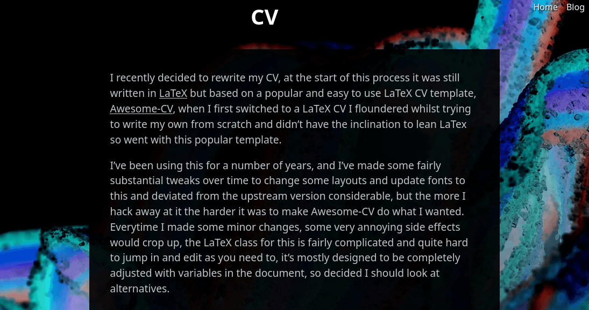
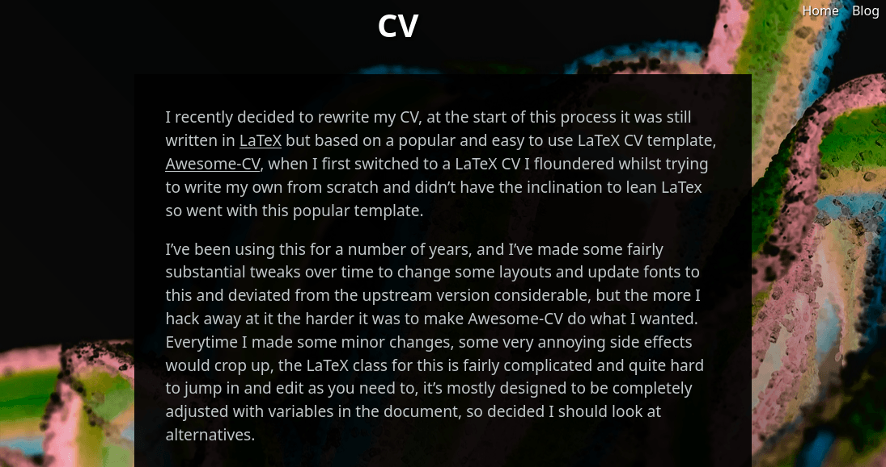

As I was redoing my CV it was repeatedly suggested that I blog about it, I really dislike the idea of blogging as I'm
not convinced I'm capable of writing posts that don't drone off missing the interesting aspects, but my friends were
quite insistent.

Only time will tell if I keep writing posts, but irrespective, the new site gives me the flexibility to make changes and
add things to the site with substantially less hassle than the old site.

My old site was a single page site, served by a custom go binary because I got frustrated with nginx, whilst I could
have fairly easily adjusted the code to serve a blog and handwritten each post, this felt like too much reinventing the
wheel even for me. A static site generator would give me the flexibility to keep the site lightweight, theming would be
almost the same as writing hand writing a site but mean I get some nice tooling such as live reload, asset building and
minification. As I'm not a fan of running javascript for anything server side, the obvious choice here
was [Hugo](https://gohugo.io/).

The theme is essentially the site I previously had, but I have done some long overdue CSS tidying and started using scss
as this is now trivial to do.  I'm not 100% convinced by the theme so far, but its working OK, the most notable change
made during this was the change in the dark background, with the light theme there was enough contrast between the 
background and the foreground, but on the dark theme this just seemed off, so I made a change to my background as below:

Not a major change, but I think it made the site much more readable, I also removed all the animation from the front, it
was a nice novelty but that did wear off quite quickly and served no real benefit.  I'm still not totally happy with this
but can't think of any major improvements, if you've got any ideas, 
[I'd be happy to hear them](https://github.com/greboid/greboid.com/discussions).
